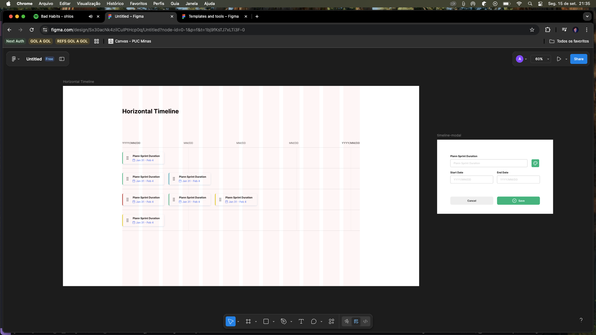

# Horiz## Project Overview

This interactive timeline showcases:

- **Smart Lane Assignment**: Events are automatically organized into lanes without overlap using an intelligent assignment algorithm
- **Proportional Rendering**: Each event's width reflects its actual time duration for accurate visual representation
- **Drag & Drop Functionality**: Events can be dragged between lanes for easy reorganization
- **Dynamic Zoom Controls**: Zoom in/out with adaptive date headers that adjust based on zoom level
- **Interactive Components**: Hover states, visual feedback, and smooth transitions
- **UI from Figma**: Professionally designed in Figma and transcribed into clean, responsive code
- **Responsive Layout**: Horizontal scrolling timeline that adapts to different screen sizesmeline Project

A clean, interactive timeline component built with **Next.js**, **TypeScript**, **Tailwind CSS**, and **React DnD**.
This project demonstrates a **lane assignment algorithm**, **drag-and-drop functionality**, **zoom controls**, and dynamic rendering of events with proportional widths based on their duration.

---

## Project Overview

This timeline showcases:

- **Lane Assignment**: Events are organized into lanes without overlap
- **Proportional Rendering**: Each event’s width reflects its actual time duration
- **UI from Figma**: Designed in Figma and transcribed into code
- **Responsive Layout**: Works with horizontal scrolling for larger datasets

---

## What I Like About This Implementation

- I enjoyed designing the UI/UX of the timeline in **Figma** and then bringing it into code.
- The **drag-and-drop functionality** makes the timeline truly interactive and user-friendly.
- **Zoom controls** with adaptive date formatting provide excellent user experience across different time scales.
- The modular structure (Header, Lanes, Events, Controls) keeps the codebase clean and ready for future features.
- **Smart lane assignment algorithm** automatically organizes events without overlap.
- It was rewarding to see the **visual alignment between dates and events** come to life with interactive capabilities.

---

## What I Would Change If Doing It Again

- Spend **less time in Figma** and more on the lane assignment logic.
- Improve **text handling** for short-duration events (ellipsis, tooltips, or adaptive rendering).
- Add animations and interactivity (hover states, tooltips).
- Add **keyboard navigation** support for better accessibility
- Implement **event editing** (double-click to edit event details)
- Add **date range selection** and filtering capabilities
- Enhance **mobile experience** with touch gestures and better responsive design
- Add **undo/redo** functionality for drag operations

---

## Design Decisions

- I analyzed **Gantt charts** and tools like **Jira, Monday, GitHub Projects**, and especially this Figma Community reference:
  👉 [Figma Timeline Reference](https://www.figma.com/community/file/1196989315003635639)
- After that I made a simple Figma Wireframe to have as guide
  

- I chose **Next.js + Tailwind CSS** for rapid development and a consistent design system.
- Events are dynamically rendered from structured data (`assignLanes`), making the layout adaptive.

---

## Tech Stack & Dependencies

### Core Technologies

- **Next.js 15** - React framework with App Router and Turbopack
- **React 19** - Latest React version with improved performance
- **TypeScript** - Type safety and developer experience
- **Tailwind CSS 4** - Utility-first CSS framework for rapid styling

### Key Libraries

- **React DnD** - Drag and drop functionality for timeline events
- **Lucide React** - Beautiful, customizable icons (Calendar, ZoomIn, ZoomOut)
- **Class Variance Authority (CVA)** - Component variant management
- **Tailwind Merge** - Intelligent Tailwind class merging

### Development Tools

- **ESLint** - Code linting and formatting
- **Prettier** - Code formatting with Tailwind plugin
- **tw-animate-css** - Additional Tailwind animations

---

## Testing Strategy (If I Had More Time)

- **Unit tests & integration tests** with **Jest** (lane assignment, event positioning).
- **Accessibility tests** (keyboard navigation, ARIA labels, color contrast).
- **Cross-device testing**: responsive behavior on mobile and tablet.
- **Edge cases**: very long names, overlapping events, and single-day milestones.

---

## Getting Started

### Prerequisites

- Node.js (18 or higher)
- npm, yarn, pnpm, or bun

### Installation

1. Clone the repository:

```bash
git clone https://github.com/oarthurfc/timeline
```

2. Install dependencies:

```bash
npm install
# or
yarn install
# or
pnpm install
# or
bun install
```

3. Run the development server:

```bash
npm run dev
# or
yarn dev
# or
pnpm dev
# or
bun dev
```

4. Open [http://localhost:3000](http://localhost:3000) to see the timeline.

---

## Data Structure

Each timeline event has the following structure:

```typescript
{
  id: number;
  start: string; // ISO date, e.g. "2021-01-14"
  end: string; // ISO date, e.g. "2021-01-22"
  name: string; // Event description
}
```

Events are passed into `assignLanes()`, which groups them into lanes and returns a nested array of events for rendering.

---

## Interactive Features

### 🎯 Drag & Drop

- **Event Reordering**: Drag events between different timeline lanes
- **Visual Feedback**: Events become semi-transparent while dragging
- **Drop Zones**: Lanes highlight when hovering with a dragged event
- **Smart State Management**: Automatic lane cleanup and reorganization

### 🔍 Zoom Controls

- **Dynamic Scaling**: Zoom from 50% to 300% with smooth transitions
- **Adaptive Headers**: Date formatting automatically adjusts based on zoom level
  - **High zoom**: Shows individual days (e.g., "Jan 14", "Jan 15")
  - **Medium zoom**: Shows weekly intervals (e.g., "Jan 14", "Jan 21")
  - **Low zoom**: Shows monthly intervals (e.g., "Jan 2021", "Feb 2021")
- **Proportional Layout**: All elements scale consistently maintaining visual relationships

### 📅 Smart Timeline Header

- **Context-Aware Dates**: First and last dates always show full context (month + year)
- **Responsive Intervals**: Date markers adjust spacing based on zoom level
- **Sticky Position**: Header remains visible during vertical scrolling

### 🎨 Enhanced UX

- **Hover Effects**: Visual feedback on interactive elements
- **Cursor States**: Changes to grab/grabbing during drag operations
- **Color Coding**: Color accent border for better event identification
- **Responsive Design**: Horizontal scrolling adapts to viewport size

---

## Project Structure

```
├── src/
│   ├── app/
│   │   ├── components/
│   │   │   ├── Timeline.tsx              # Main timeline container with DnD provider
│   │   │   ├── TimelineHeader.tsx        # Adaptive date header with zoom-aware formatting
│   │   │   ├── TimelineLane.tsx          # Drop zone lanes with hover effects
│   │   │   ├── DraggableEventCard.tsx    # Interactive event cards with drag functionality
│   │   │   └── ZoomControls.tsx          # Zoom in/out controls with visual feedback
│   │   ├── globals.css                   # Global styles and Tailwind directives
│   │   ├── layout.tsx                    # Root layout with metadata
│   │   └── page.tsx                      # Home page component
│   ├── data/
│   │   └── timelineItems.ts              # Sample timeline events data
│   ├── lib/
│   │   ├── assignLanes.ts                # Smart lane assignment algorithm
│   │   ├── timelineUtils.ts              # Date calculations and event positioning
│   │   └── utils.ts                      # Utility functions and helpers
│   └── types/
│       └── timeline.ts                   # TypeScript definitions for timeline data
├── components.json                       # Shadcn/UI configuration
├── tailwind.config.js                    # Tailwind CSS configuration
├── tsconfig.json                         # TypeScript configuration
└── README.md
```

---

**Created by Arthur Ferreira Costa**
_Horizontal Timeline Project_
